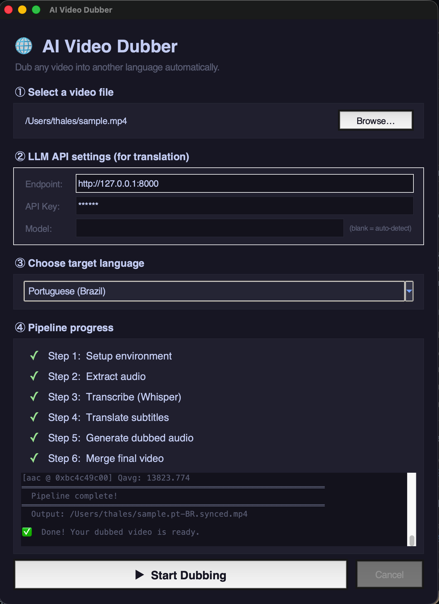

# AI Video Dubber

Automatically dub any video into another language using a fully local pipeline:

**Video → Audio → Transcription → Translation → Text-to-Speech → Dubbed Video**



## Quick Start

### GUI (no command line needed)

```bash
python3 gui.py
```

A graphical interface will open where you can browse for a video, pick a language, and click **Start Dubbing**.

### Command line

```bash
bash dub_video.sh --input my-video.mp4 --language pt-BR
# → my-video.pt-BR.synced.mp4
```

That single command runs the full pipeline:

| Step | What happens | Tool |
|------|-------------|------|
| 0 | Setup environment (auto-installs dependencies) | pip + venv |
| 1 | Extract audio from video | ffmpeg |
| 2 | Transcribe audio → subtitles | [OpenAI Whisper](https://github.com/openai/whisper) (local) |
| 3 | Translate subtitles | LLM via OpenAI-compatible API |
| 4 | Generate synced TTS audio | [Piper TTS](https://github.com/rhasspy/piper) (local) |
| 5 | Merge dubbed audio + original video | ffmpeg |

## Supported Languages

| Language | Code | Piper Voice |
|----------|------|-------------|
| Portuguese (Brazil) | `pt-BR` | `pt_BR-faber-medium` |
| Spanish | `es` | `es_ES-davefx-medium` |
| French | `fr` | `fr_FR-siwis-medium` |
| German | `de` | `de_DE-thorsten-medium` |
| Italian | `it` | `it_IT-riccardo-x_low` |

## Requirements

- **Python 3.10+**
- **ffmpeg** and **ffprobe** in PATH
- An **OpenAI-compatible LLM API** for translation (see [Configuration](#configuration))

All Python dependencies (OpenAI Whisper, Piper TTS) are **installed automatically** into a `.venv` virtual environment on the first run. No manual `pip install` needed.

### Install system dependencies

```bash
# macOS
brew install ffmpeg python-tk@3.14   # python-tk only needed for the GUI

# Ubuntu/Debian
sudo apt-get install ffmpeg python3-tk
```

## Usage

### Full pipeline (recommended)

```bash
# Dub a video into Brazilian Portuguese
bash dub_video.sh --input video.mp4 --language pt-BR

# Dub into Spanish, re-running all steps even if intermediate files exist
bash dub_video.sh --input video.mp4 --language es --force
```

### Individual scripts

Each step can also be run independently:

```bash
# 1. Extract audio
bash extract_audio.sh video.mp4 video.mp3

# 2. Transcribe (requires openai-whisper)
python whisper_to_timestamps.py --input video.mp3

# 3. Translate subtitles
LLM_API_BASE="http://your-server:8000" \
python translate_srt.py --input video.srt --output video.pt-BR.srt --language "Brazilian Portuguese (pt-BR)"

# 4. Generate synced TTS audio
bash run_sync_ptbr.sh video.pt-BR.srt video.pt-BR.synced.mp3

# 5. Replace audio track
bash replace_audio.sh video.mp4 video.pt-BR.synced.mp3
```

## Configuration

### LLM API

The translation step requires an OpenAI-compatible API (vLLM, Ollama, LM Studio, etc.).

In the **GUI**, fill in the Endpoint, API Key, and Model fields before starting.

From the **command line**, use environment variables:

```bash
LLM_API_BASE="http://your-server:8000" \
LLM_API_KEY="your-api-key" \
LLM_MODEL="your-model-name" \
bash dub_video.sh --input video.mp4 --language pt-BR
```

If `LLM_MODEL` is left empty, the script auto-detects the first available model from the API.

### TTS Voice

Override the Piper voice for any language:

```bash
VOICE=pt_BR-cadu-medium bash run_sync_ptbr.sh input.srt output.mp3
```

Available PT-BR voices: `pt_BR-faber-medium`, `pt_BR-cadu-medium`, `pt_BR-jeff-medium`, `pt_BR-edresson-low`.

Browse all Piper voices at [rhasspy/piper](https://github.com/rhasspy/piper/blob/master/VOICES.md).

### Whisper Model

Set the Whisper model via environment variable (default: `large-v3`):

```bash
WHISPER_MODEL=medium bash dub_video.sh --input video.mp4 --language pt-BR
```

## Project Structure

```
├── gui.py                        # Graphical interface (tkinter)
├── dub_video.sh                  # Master pipeline script (CLI)
├── extract_audio.sh              # Step 1: video → mp3
├── whisper_to_timestamps.py      # Step 2: audio → srt (Whisper)
├── translate_srt.py              # Step 3: srt → translated srt (LLM)
├── translate_srt.sh              # Step 3 wrapper (bash)
├── sync_ptbr_piper.py            # Step 4: srt → synced audio (Piper TTS)
├── run_sync_ptbr.sh              # Step 4 wrapper (bash, sets up venv)
├── replace_audio.sh              # Step 5: video + audio → dubbed video
└── timestamps_to_synced_audio.py # Alternative TTS using macOS `say`
```

## License

MIT
